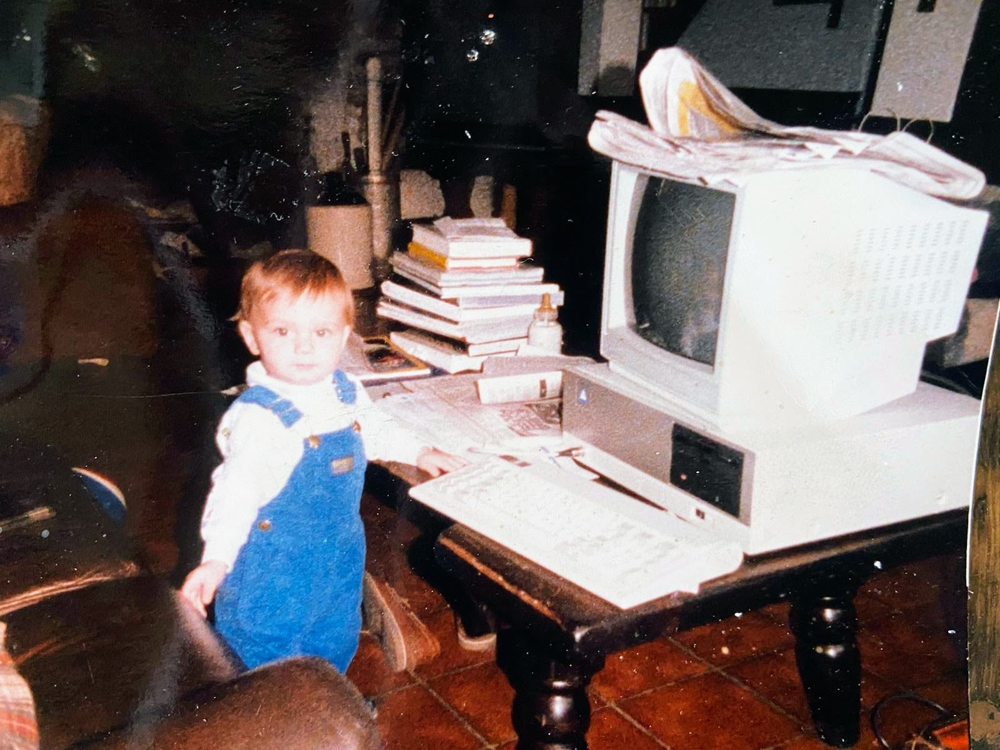
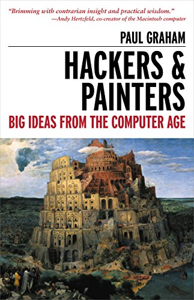

# PJensen

Software architect and AI systems builder focused on collapsing the distance between idea and execution. I design AI-native development environments, simulation substrates, and governed application systems that allow complex software to emerge quickly, safely, and iteratively.

My work tends to live underneath the visible layer — the primitives, the state models, the constraints that shape what becomes possible. I’m interested in systems where software is synthesized rather than hand-assembled, where iteration is cheap, and where understanding compounds faster than code.

That thread runs through everything I build: deterministic simulation engines, agent-driven architectures, roguelike worlds used as system stress tests, and development environments designed to translate emerging AI capabilities into practical workflows.

I care about substrate. The layer below abstraction. The mechanics that make complex systems navigable.

Outside of software, I paint, sculpt, ski, drum, and grow rare medicinal plants. Each discipline reinforces the same idea: precision and creativity are not opposites — they sharpen each other.

---

Projects

ecs-js — A tiny, deterministic Entity–Component–System core in pure JavaScript. Zero dependencies. No build step. Fourteen source files.

Caller-driven ticking — the library has no opinion about time

Phase-agnostic system scheduling with topological ordering (before/after)

Seeded PRNG + deferred structural mutation = deterministic simulation

Snapshot / restore for replay, branching, and time travel

Archetypes, hierarchy management, cross-world references

Query builder with where, project, orderBy, offset, limit

Entity-local scripting via handler tables

Storage flexibility: map for clarity, soa for throughput

Built for simulations, agent systems, and complex interactive state.

Other Projects

JSHack — A roguelike world used as an architectural stress test for agent-driven systems and simulation design.

DotNetHack — Earlier roguelike experiment exploring emergent mechanics and system-driven gameplay.

Deity-JS — A headless mood and influence engine for simulations and games.

Pixel_Buzz_Box — A real-time survival game for Raspberry Pi Pico in an infinite procedural world.

---

Writing

I publish on Substack — essays on AI-native development, simulation architecture, substrate design, and systems thinking.

---

&nbsp;&nbsp;&nbsp;

