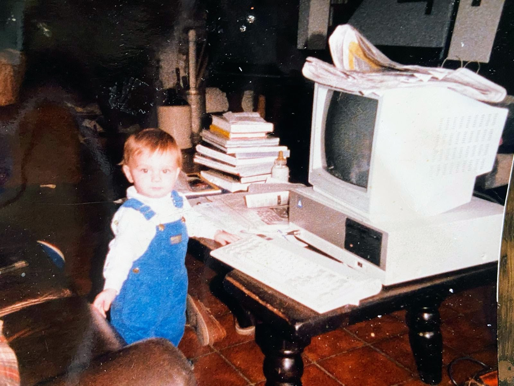
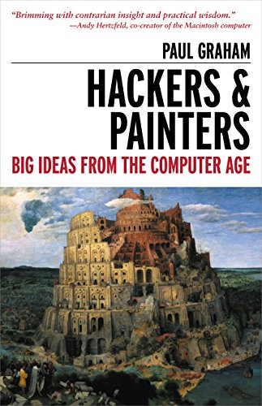

# PJensen

Software architect and AI systems builder focused on collapsing the distance between idea and execution. I design AI-native development environments, simulation substrates, and governed application systems that allow complex software to emerge quickly, safely, and iteratively.

My work tends to live underneath the visible layer — the primitives, the state models, the constraints that shape what becomes possible. I’m interested in systems where software is synthesized rather than hand-assembled, where iteration is cheap, and where understanding compounds faster than code.

That thread runs through everything I build: deterministic simulation engines, agent-driven architectures, roguelike worlds used as system stress tests, and development environments designed to translate emerging AI capabilities into practical workflows.

I care about substrate. The layer below abstraction. The mechanics that make complex systems navigable.

Outside of software, I paint, sculpt, ski, drum, and grow rare medicinal plants. Each discipline reinforces the same idea: precision and creativity are not opposites — they sharpen each other.

---

## Projects

- [ecs-js](https://github.com/PJensen/ecs-js) — Deterministic, zero-dependency Entity–Component–System architecture for JavaScript.
- [blackstem](https://github.com/PJensen/blackstem) — Inspectable compiler pipeline that turns bounded language into executable tool plans.
- [reflect-js-mcp](https://github.com/PJensen/reflect-js-mcp) — MCP server for structural reflection, symbol lookup, dependency graphs, and architectural analysis.
- [Signal Control Tower](https://github.com/PJensen/signal-control-tower) — Local Signal-to-Codex work dispatcher with durable queues, validation, and artifact delivery.
- [JSHack](https://github.com/PJensen/JSHack) — Mobile-first browser roguelike and living systems-design laboratory.
- [Graffiti](https://github.com/PJensen/grafitti) — Real-time collaborative drawing system built around exact scenes, spatial data, and durable world state.
- [Pixel Buzz Box](https://github.com/PJensen/Pixel_Buzz_Box) — Raspberry Pi Pico arcade survival game set in an infinite procedural world.

---

Writing

I publish on Substack — essays on AI-native development, simulation architecture, substrate design, and systems thinking.

---

&nbsp;&nbsp;&nbsp;

